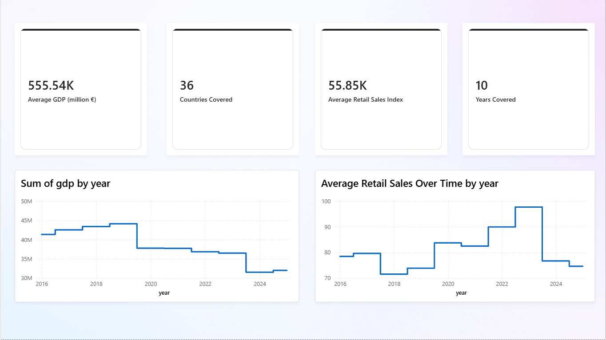
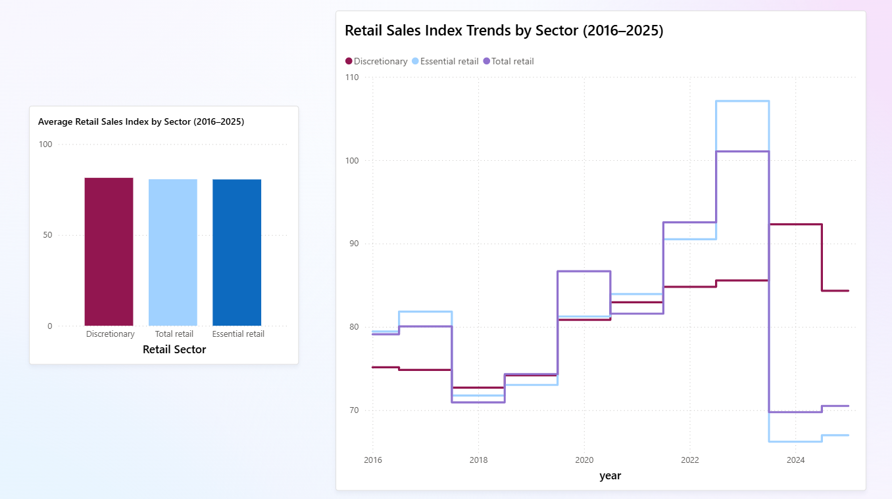
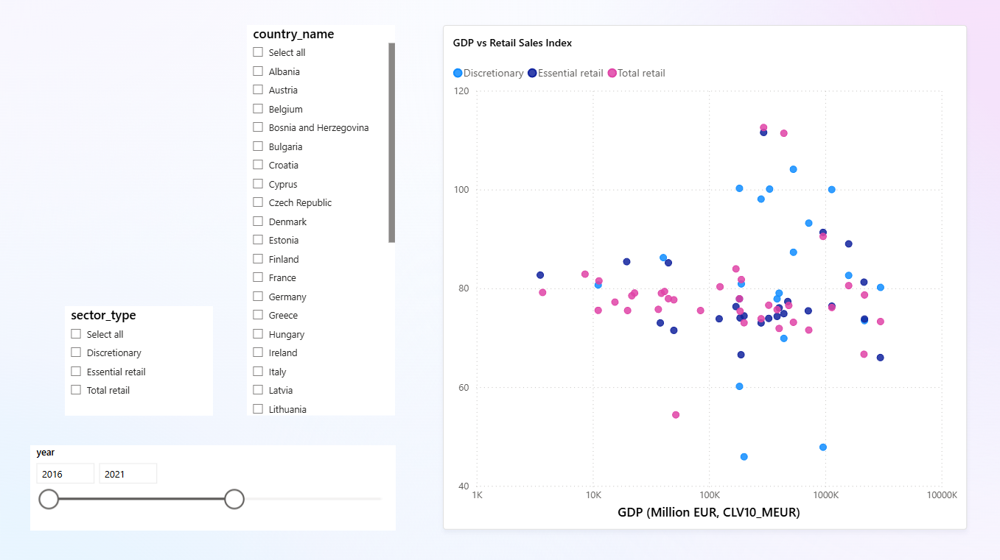

# Lipstick Effect Exploration: Retail Consumption and Economic Cycles in Europe

## Project Overview

This project explores the relationship between macroeconomic conditions and retail sales across European countries between 2016 and 2025.

The analysis investigates whether different retail categories respond differently to economic conditions by comparing:

* GDP data represents economic scale and growth conditions rather than individual consumer spending.
* Total retail trade
* Essential retail proxy categories
* Discretionary retail proxy categories

The project explores whether observed retail patterns are consistent with the "lipstick effect" hypothesis, where consumer spending behaviour may shift during periods of economic uncertainty.

The analysis does not attempt to prove the lipstick effect directly, as the dataset does not measure luxury cosmetics consumption. Instead, it evaluates whether broader retail sector patterns provide supporting evidence for similar consumer behaviour changes.

---

# Research Question

## Main Research Question

How do different retail sectors in Europe respond to changes in macroeconomic conditions, and are observed patterns consistent with the lipstick effect hypothesis?

## Objectives

* Compare retail performance across different NACE Rev. 2 retail categories
* Examine differences between essential retail proxies and discretionary retail proxies
* Analyse the relationship between GDP changes and retail sales changes
* Identify whether certain retail sectors show greater resilience during economic fluctuations

---

# Datasets Used

## 1. GDP and Macroeconomic Indicators

**Source:** Eurostat

**Indicator:** GDP (chain-linked volumes, 2010 prices)

**Unit:** CLV10_MEUR (million euro, constant prices)

**Licence:** European Union Open Data Licence (EU ODL)

**Purpose:**
Used as an indicator of macroeconomic conditions and economic cycles across European countries.

---

## 2. Retail Trade Data

**Source:** Eurostat Structural Business Statistics

**Classification:** NACE Rev. 2 (Retail Trade - G47 sector)

**Licence:** Eurostat free reuse policy

Selected categories:

| Code        | Description                                        | Interpretation                  |
| ----------- | -------------------------------------------------- | ------------------------------- |
| G47         | Total retail trade                                 | Overall retail sector baseline  |
| G47_NF_HLTH | Retail trade excluding food, beverages and tobacco | Essential-oriented retail proxy |
| G476        | Retail sale of cultural and recreational goods     | Discretionary retail proxy      |

---

# Tools & Technologies

* Python (Pandas, NumPy)
* Matplotlib
* Seaborn
* Jupyter Notebook
* SQL (schema design and analytical queries)
* Power BI (data visualisation)
* Git & GitHub (version control)

---

# Data Preparation

The dataset preparation process included:

* Standardising country identifiers and time periods
* Filtering relevant NACE Rev. 2 retail categories
* Removing duplicates and invalid records
* Checking missing values and dataset consistency
* Aligning GDP and retail data at country-year level
* Creating sector labels for analysis
* Engineering growth variables to compare yearly changes

---

# Analytical Approach

The analysis follows three stages:

## 1. Dataset Exploration

* Dataset structure and completeness checks
* Distribution analysis of GDP and retail sales values
* Identification of differences between countries and sectors
* Log transformation to improve comparability across economies

## 2. Retail Sector Comparison

Comparison of:

* Total retail activity
* Essential-oriented retail proxy category
* Discretionary retail proxy category

Analysis focuses on:

* Average sector performance
* Differences between categories
* Stability and volatility patterns

## 3. GDP–Retail Relationship

The relationship between economic conditions and retail behaviour is examined through:

* GDP and retail trends over time
* Correlation analysis
* GDP growth vs retail sales growth comparisons
* Cross-country observations

---

# Key Findings

The exploratory analysis and Power BI dashboard indicate several patterns in European retail behaviour between 2016 and 2025:

- GDP and retail sales generally move in the same direction, showing an overall positive relationship between economic conditions and retail activity.

- Retail categories follow similar long-term trends, suggesting that broader economic conditions influence multiple sectors simultaneously.

- Discretionary retail (G476) shows different behaviour from total retail and the essential retail proxy category, with periods where it appears less aligned with broader retail movements.

- The essential retail proxy category (G47_NF_HLTH) does not consistently demonstrate the highest stability. In some periods, particularly between 2023 and 2025, it shows larger changes compared with discretionary retail.

- Between 2023 and 2024, total retail and the essential retail proxy category experienced noticeable declines, while discretionary retail showed a comparatively smaller decline.

- GDP growth and retail sales growth show a relatively weak short-term relationship, suggesting that consumer behaviour is influenced by additional factors beyond GDP changes alone.

Overall, the findings provide some supporting evidence that retail categories may respond differently during economic fluctuations. However, the analysis does not prove the lipstick effect hypothesis, and further statistical modelling would be required to measure sector sensitivity and causal relationships.
---

# Power BI Dashboard

The final dataset was visualised using Power BI to explore relationships between economic conditions and retail sector behaviour.

The dashboard contains three pages:

## Page 1 — Overview

Provides a high-level summary of the dataset, including:

- Average GDP across analysed countries
- Average retail sales values
- Number of countries included
- Time period covered
- GDP trends over time
- Retail sales trends over time


## Page 2 — Sector Comparison

Explores differences between retail categories:

- Average retail sales by sector
- Comparison between:
  - Total retail (G47)
  - Essential retail proxy (G47_NF_HLTH)
  - Discretionary retail (G476)
- Sector trends over time


## Page 3 — GDP vs Retail Sales

Examines the relationship between economic conditions and retail behaviour:

- GDP compared with retail sales values
- Country-level filtering
- Year filtering
- Retail category filtering

A logarithmic scale was used for GDP comparison to improve visual interpretation due to differences in economic size between countries.

## Dashboard Preview







# Project Structure

```
├── Data/
│   ├── Raw/
│   └── Processed/

├── Notebooks/
│   ├── 01_gdp_cleaning.ipynb
│   ├── 02_sales_cleaning.ipynb
│   ├── 03_data_integration.ipynb
│   └── 04_eda.ipynb

├── SQL/
│   ├── schema.sql
│   └── queries.sql

├── PowerBI/
│   └── retail_economic_analysis.pbix

├── requirements.txt
├── DATA_LICENSES.md
├── LICENSE
└── README.md
```

---

# Limitations

This analysis has several limitations:

- The dataset measures retail sector activity rather than individual consumer spending behaviour.
- The lipstick effect hypothesis cannot be directly tested because luxury cosmetics data is not included.
- GDP is used as a broad economic indicator and does not capture all factors affecting consumer decisions.
- Differences between countries may be influenced by population size, inflation, policy changes, and market structure.


# Future Improvements

Potential extensions include:

* Regression modelling to estimate GDP–retail sensitivity
* More detailed lag analysis between GDP changes and retail responses
* Inflation-adjusted consumption measures
* Additional NACE sector breakdowns
* Expansion to additional regions

---

# Author

Kamile Kavaliauskaite

Data Analytics Portfolio Project

---

Data preparation and exploratory analysis were performed using Python (Pandas, NumPy, Matplotlib and Seaborn). SQL schema design and analytical queries are included to document the final dataset structure.
